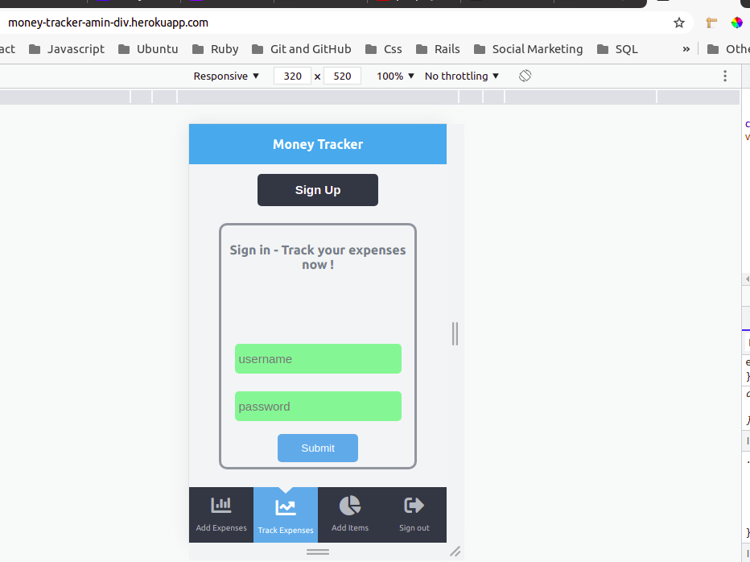
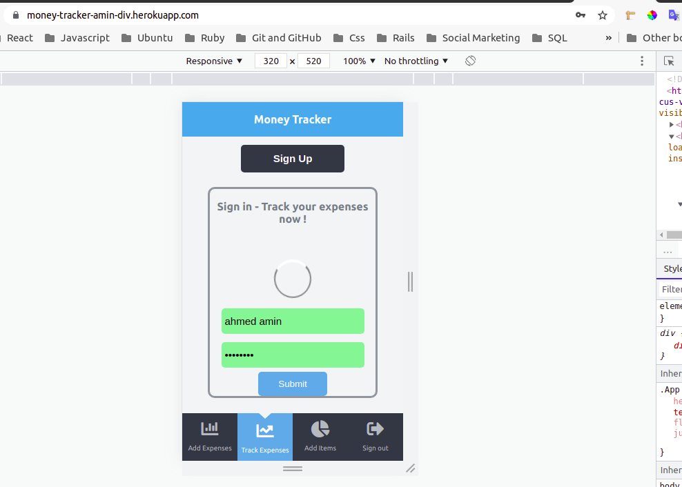
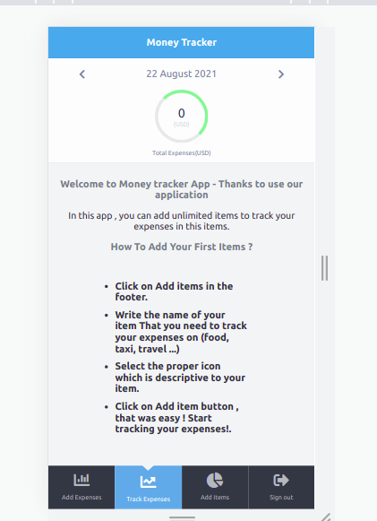
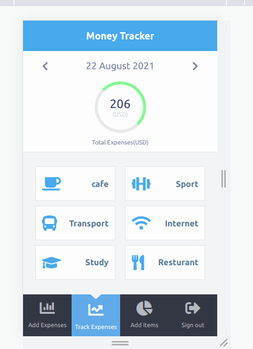
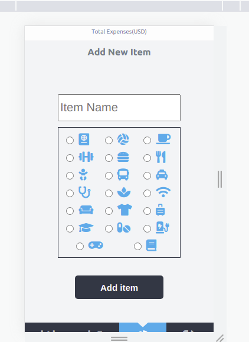
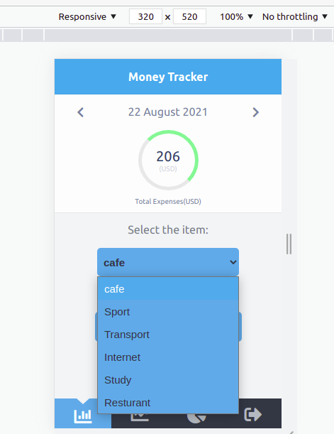
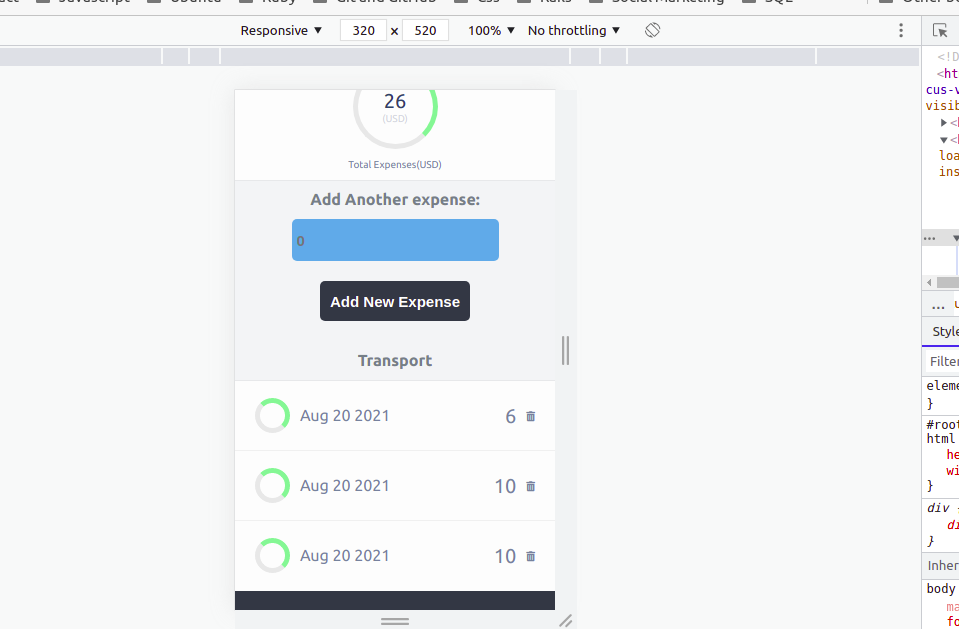
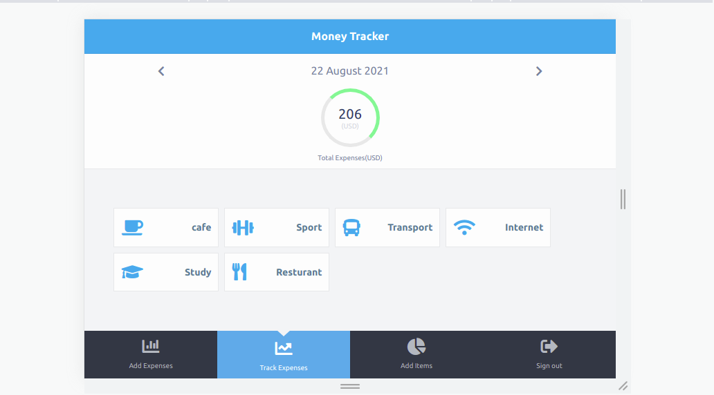
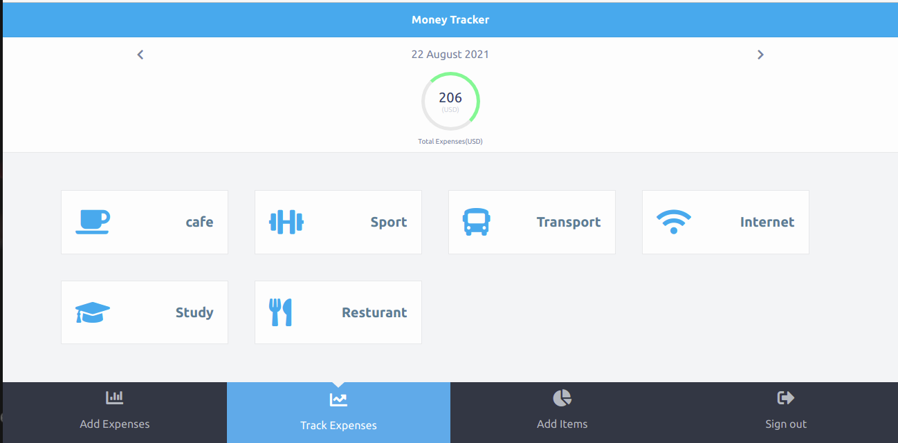

# Money Tracker Application

 
> This is a Final capstone project in Microverse. This is a money tracker application for tracking expenses for unlimited items for each user.  

# In this application:
- The user can create an account with only a username and password.
- After creating an account, the user will find instructions on who to add new items.
- The user can start adding items and things that (he/she) needs to track expenses on this item. For example transportation, restaurants, kids .. etc.
- The user dashboard contains a list of all items that the user-created when the user clicks on this item the user will introduce to a single page of each item with all expenses with the date of each expense.
- The user can add another expense from two places: Add expenses page which the user will find a list of all items and (he/she) will select the item and add the expense or from the single page.
- At the top of each page the user will find the total of all expenses.


# Login screen:
 

 

# Dashboard:

1. Instructions:
-  


2. After adding items:

-  

# Add items page:

 


# Add expenses page:

 


# Single page of items:

 

# Live Version:
[Money Tracker App](https://money-tracker-amin-div.herokuapp.com/)


## Built With
1. Front-End:
- React.
- JS.
- CSS.
- Jest.
- React test library.

2. Back-End:
- Ruby on Rails API.
- Ruby.
- Postgresql.
- RSpec.


## Setup

1. To run this project locally, please ensure you have npm installed.
2. Open the terminal.
3. Clone this repository by running:

```bash
git clone https://github.com/AhmedAmin90/moneyTracker-frontEnd
```

4. To install the dependencies Open your terminal at the project folder: 

```bash
npm install
```

5. Start the server :

```bash
npm start
```

5.To run tests:

```bash
npm run test
```

# Notes:
1. I followed the design:
https://www.behance.net/gallery/13271423/Bodytrackit-An-iOs-app-Branding-UX-and-UI
Design idea by Gregoire Vella on Behance

2. Responsive Design:
- Tablet:
 

- Laptop:
 


## Authors

**Ahmed Amin** 
- GitHub: [Profile](https://github.com/AhmedAmin90)
- LinkedIn: [Profile](https://www.linkedin.com/in/web-developer/)
- AngelList: [Profile](https://angel.co/u/ahmed-amin-22)
- Twitter: [Profile](https://twitter.com/AhmedAmin12383)
- Portfolio: [My Portfolio](https://amin-dev-me.netlify.app/)


## Contribute
Any advice and suggestion for improvement are more than welcome.
Visit [issues' section](https://github.com/AhmedAmin90/moneyTracker-frontEnd/issues)

## Show your support
Give a star if you like this project!

## License
<p>This project is <a href="./LICENSE">MIT</a> licensed.</p>
